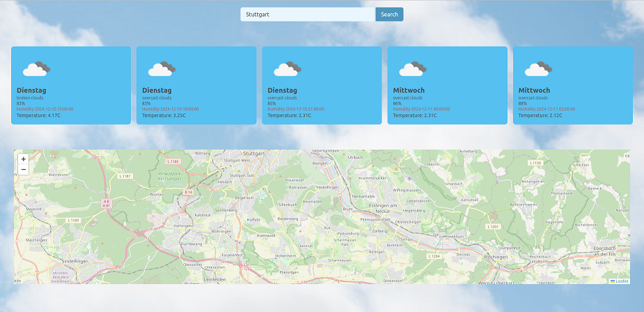

# Weather Dashboard Application

This **Weather Dashboard Application** provides users with accurate weather forecasts and a visual map for any city worldwide. 
The app is built using modern web technologies and showcases dynamic functionality and responsive design.



---

## 🌟 Features

- **City Weather Search:** Enter a city.
- **Weather Details:** Includes temperature, humidity, and a visual weather icon.
- **Interactive Map:** Displays the city's location on a map using Leaflet.js.
- **Dynamic Background:** A visually appealing background that adapts to the app's theme.
- **Responsive Design:** Fully responsive layout for desktop, tablet, and mobile users.

---

## 🛠️ Technologies Used

- **Frontend Framework:** React.js
- **State Management:** React Context API
- **API Integration:** 
  - [OpenWeatherMap](https://openweathermap.org/) for weather data.
  - [OpenStreetMap](https://www.openstreetmap.org/) for location mapping.
- **Styling:** Tailwind CSS for modern, responsive styling.
- **Mapping Library:** Leaflet.js for interactive maps.
- **Axios:** For seamless HTTP requests.

---

## 🛠️ Installation and Setup

1. Clone the repository:
   ```bash
   git clone git@github.com:Sandreass/Wetter-App.git
    ```
2. Install the dependencies:
    ```bash
    npm install
    ```

3.  Set up environment variables: 
    ```env
    add your API key
    ```

4. Start the development server:
    ```bash
    npm run dev
    ```
---
